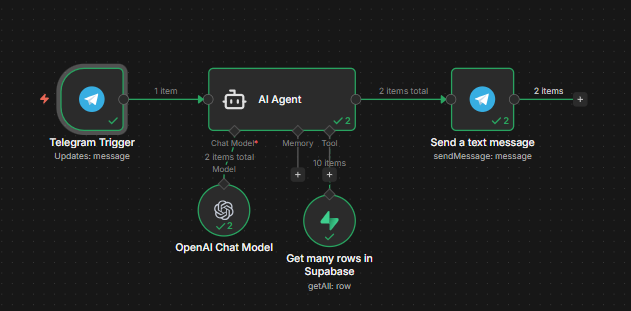

# Plataforma de Dados E-commerce

Este projeto simula uma **plataforma de dados real para uma empresa de e-commerce**, com ingestão, transformação e análise de dados de múltiplas fontes armazenadas no **AWS S3**. O objetivo é gerar **insights acionáveis** para tomada de decisão.

## Objetivos do Projeto
- Analisar dados de vendas e clientes
- Comparar preços de produtos com o mercado
- Gerar insights baseados em dados para decisões de negócio
- Criar um pipeline estruturado e escalável de transformação de dados

## Estrutura da Plataforma de Dados
O projeto segue a abordagem **bronze → silver → gold** no dbt:

- **Bronze:** Tabelas brutas provenientes de arquivos CSV e Parquet no S3 (produtos, clientes, vendas e preços de concorrentes).  
- **Silver:** Tabelas limpas e integradas, prontas para análise e relatórios.  
- **Gold:** Métricas agregadas e KPIs para tomada de decisão (ex.: clientes top, vendas por canal, competitividade de preços).

## Stack Tecnológica
- **Python (Pandas):** usado apenas para ingestão de dados do S3 para o banco.  
- **PostgreSQL (Supabase):** banco de dados para armazenar e consultar os dados brutos e transformados.  
- **dbt:** para todas as transformações, testes e documentação dos modelos.  

## Funcionalidades do Projeto
- Fontes definidas em `_sources.yml` dentro do diretório `models`.  
- Modelos organizados por camada (**bronze, silver, gold**) para transformações incrementais.  
- Documentação detalhada das colunas e tabelas para suporte ao `dbt docs`.  
- Preparado para melhorias futuras: seeds, snapshots e macros customizadas.

## Integração & Automação
- As tabelas da camada **gold** alimentam um **bot no Telegram** que responde perguntas usando um agente de IA.  
- A ingestão das respostas é feita via **n8n**, conectando PostgreSQL (Supabase) ao bot.  
- Os usuários podem interagir com o bot para obter **insights em tempo real** a partir da tabela `gold_kpi_clientes_top_rows`.

### Workflow do n8n

### Bot Telegram em Ação

## Como Usar
1. Conecte o **dbt Cloud** ao seu repositório.  
2. Configure o ambiente com o banco de dados (PostgreSQL ou outro suportado).  
3. Execute o pipeline na ordem: `bronze → silver → gold`.  
4. Utilize `dbt docs generate` e `dbt docs serve` para explorar a documentação.

## Status do Projeto
✅ Finalizado
